# WheelLog Шлем · CJ-Helmet

**Шлем и моноколесо светятся по колесу.** Телефон читает Sherman L, понимает торможение,
разгон и поворот и сразу показывает это светом: на шлеме, на втором шлеме со штатным
контроллером и на самом колесе.

*Helmet and wheel lighting driven by the unicycle: a fork of WheelLog that reads a Sherman L,
detects braking, acceleration and turns, and drives LED strips on ESP32 boards in helmets and
on the wheel, plus ZENGGE (LEDnetWF) Bluetooth controllers.*

<table>
<tr>
<td width="33%">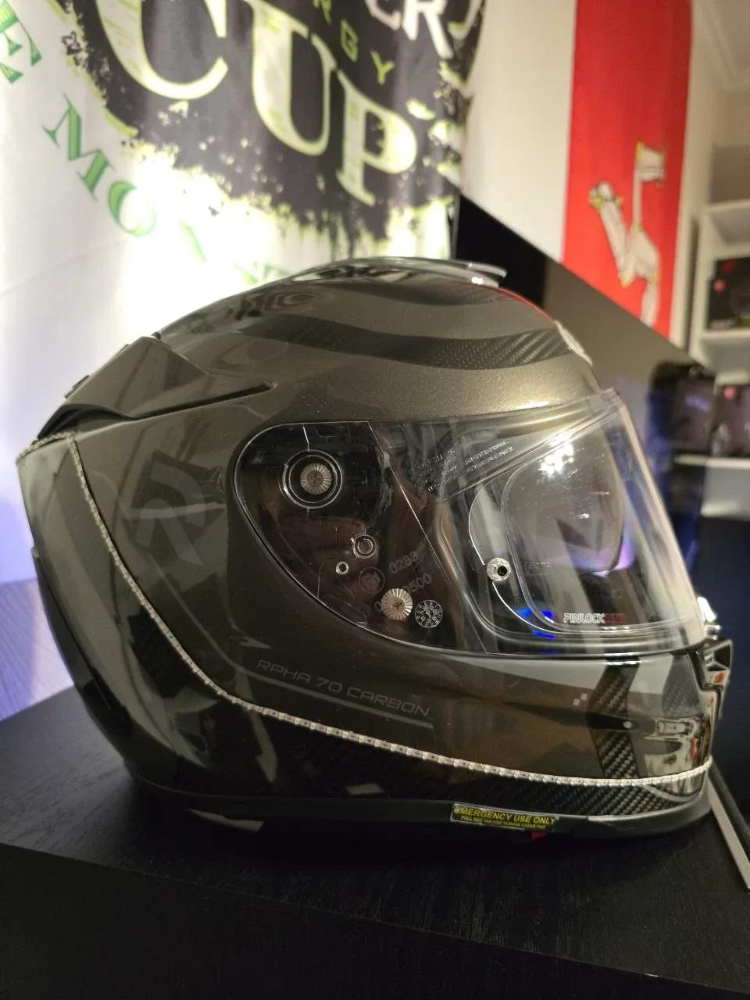</td>
<td width="33%">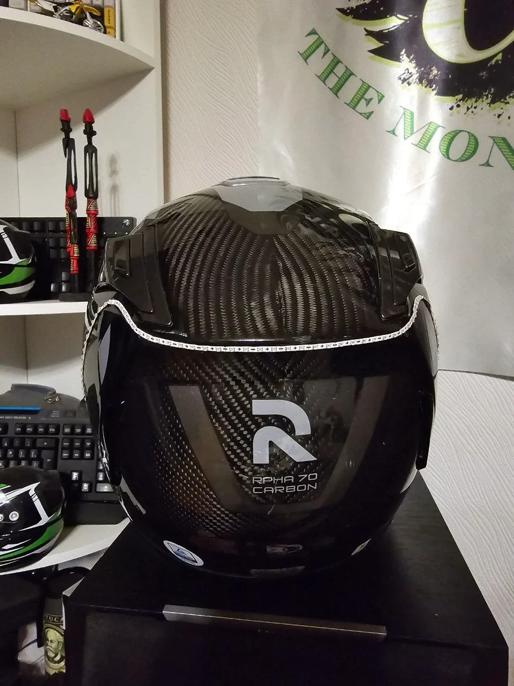</td>
<td width="33%">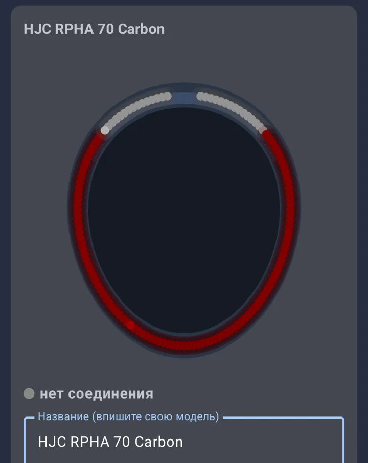</td>
</tr>
<tr>
<td align="center">HJC RPHA 70 Carbon: лента по контуру</td>
<td align="center">Сзади - стоп и поворотники</td>
<td align="center">Тот же шлем в приложении</td>
</tr>
</table>

## Как это устроено

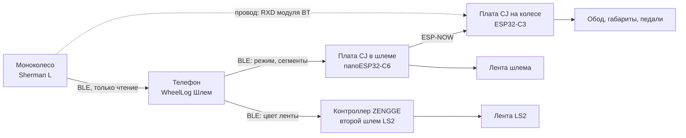
```mermaid
flowchart LR
    W["Моноколесо<br/>Sherman L"] -- "BLE, только чтение" --> P["Телефон<br/>WheelLog Шлем"]
    P -- "BLE: режим, сегменты" --> H["Плата CJ в шлеме<br/>nanoESP32-C6"]
    P -- "BLE: цвет ленты" --> Z["Контроллер ZENGGE<br/>второй шлем LS2"]
    H -- "ESP-NOW" --> K["Плата CJ на колесе<br/>ESP32-C3"]
    W -. "провод: RXD модуля BT" .-> K
    H --> L1["Лента шлема"]
    Z --> L2["Лента LS2"]
    K --> L3["Обод, габариты, педали"]
```

- **Колесу ничего не пишем.** Приложение и платы только читают данные: скорость, ток,
  наклон, PWM, напряжение. Прошивка колеса не трогается.
- **Телефон - главный.** WheelLog уже умеет говорить с колесом; поверх добавлен раздел
  «Подсветка»: шлемы и колесо в одном списке, у каждого свой вид и сегменты ленты.
- **Плата в шлеме** считает режим сама по данным телефона, держит пороги и анимацию.
- **Плата на колесе** получает режим от шлема по ESP-NOW, а может слушать колесо напрямую
  по проводу - тогда свет работает даже без телефона.

## Что показывает свет

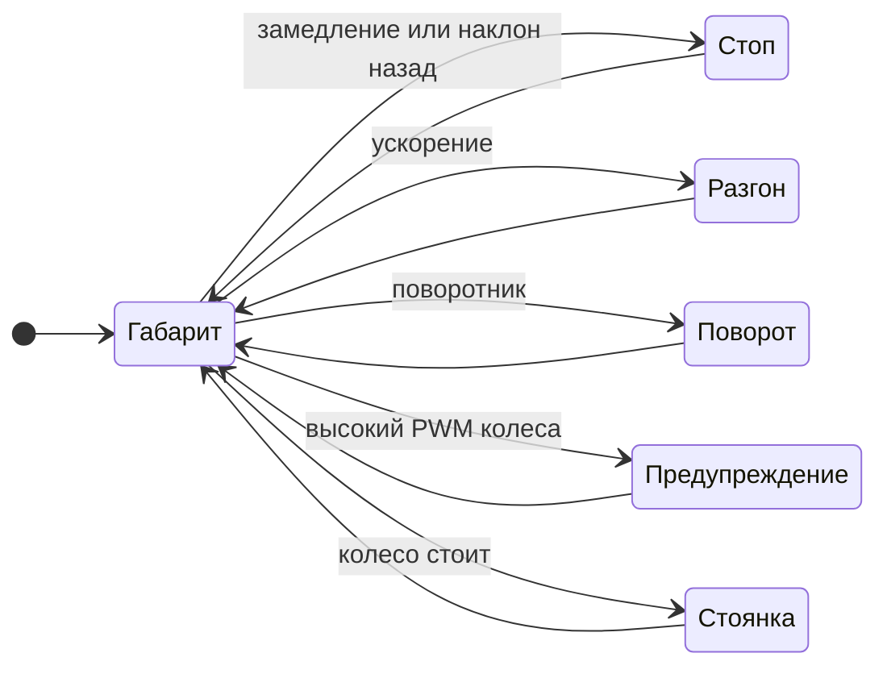
```mermaid
stateDiagram-v2
    direction LR
    state "Габарит" as idle
    state "Стоп" as brake
    state "Разгон" as accel
    state "Поворот" as turn
    state "Предупреждение" as warn
    state "Стоянка" as park
    [*] --> idle
    idle --> brake: замедление или наклон назад
    idle --> accel: ускорение
    idle --> turn: поворотник
    idle --> warn: высокий PWM колеса
    idle --> park: колесо стоит
    brake --> idle
    accel --> idle
    turn --> idle
    warn --> idle
    park --> idle
```

Лента делится на **сегменты** - перед, бока, зад: стоп горит сзади, поворотник бежит по
своему боку, разгон и габарит - своим цветом. Пороги подобраны по логам реальной езды и
настраиваются в приложении.

## Приложение

<table>
<tr>
<td width="25%">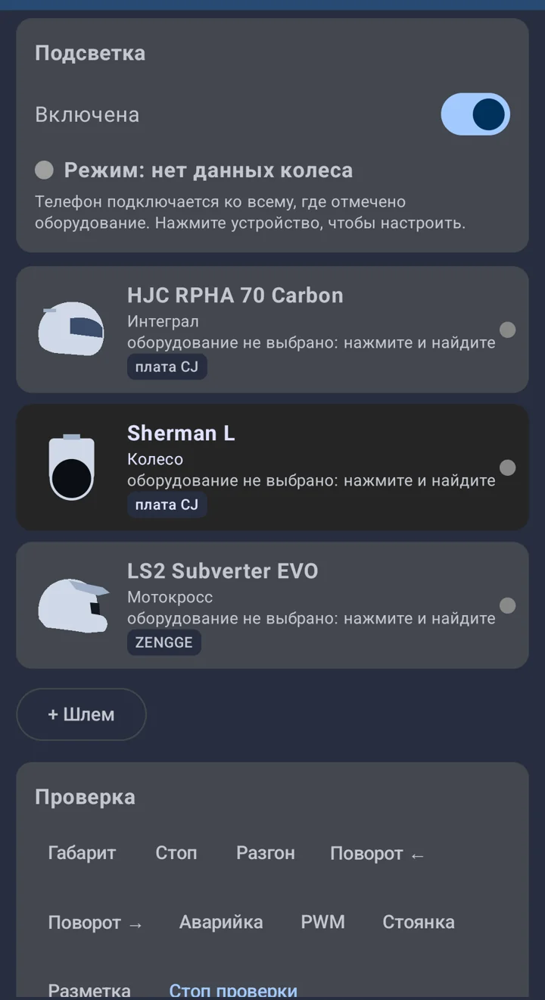</td>
<td width="25%">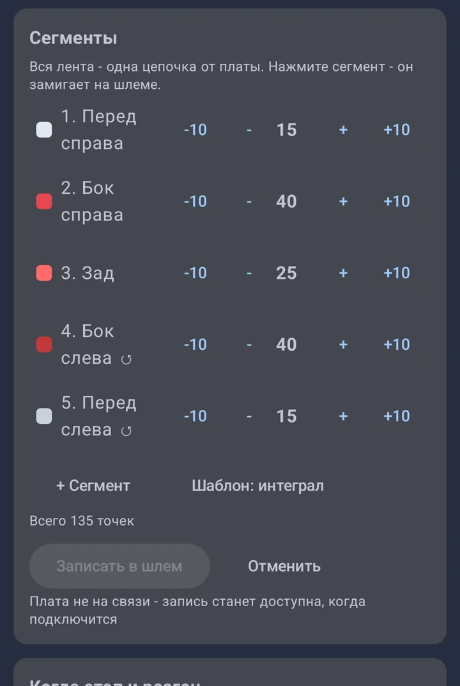</td>
<td width="25%">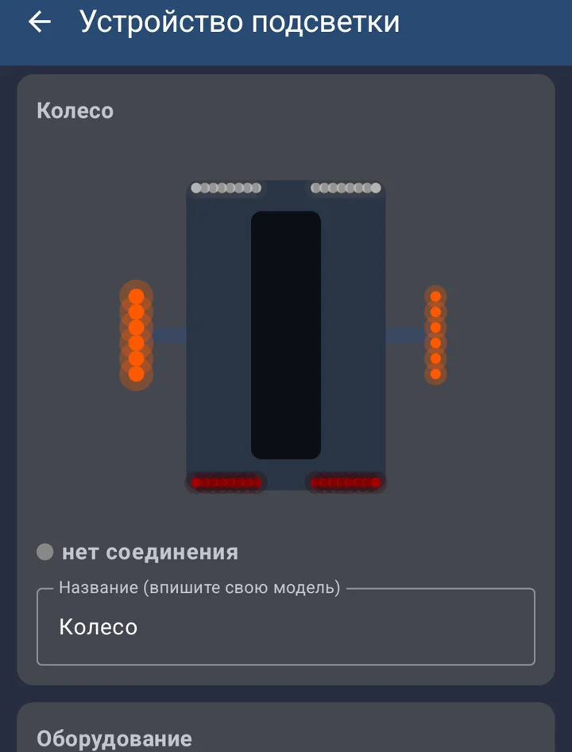</td>
<td width="25%">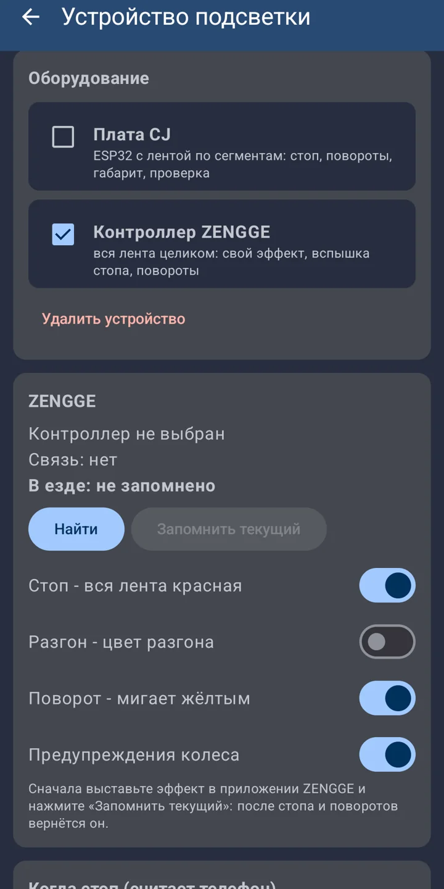</td>
</tr>
<tr>
<td align="center">Раздел «Подсветка»</td>
<td align="center">Сегменты ленты</td>
<td align="center">Колесо</td>
<td align="center">Контроллер ZENGGE</td>
</tr>
</table>

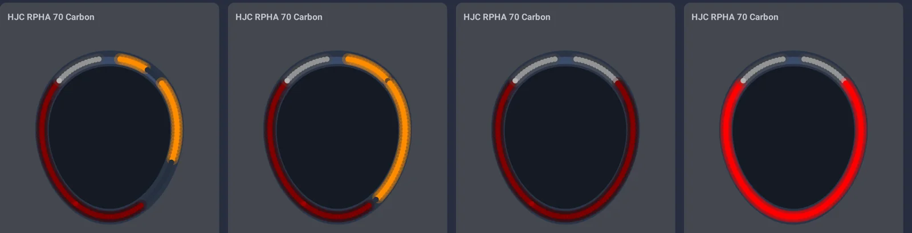

*Проверка без езды: каждый режим можно включить кнопкой и увидеть на шлеме.*

Работает и на складном телефоне - экран настроек раскладывается в две колонки:

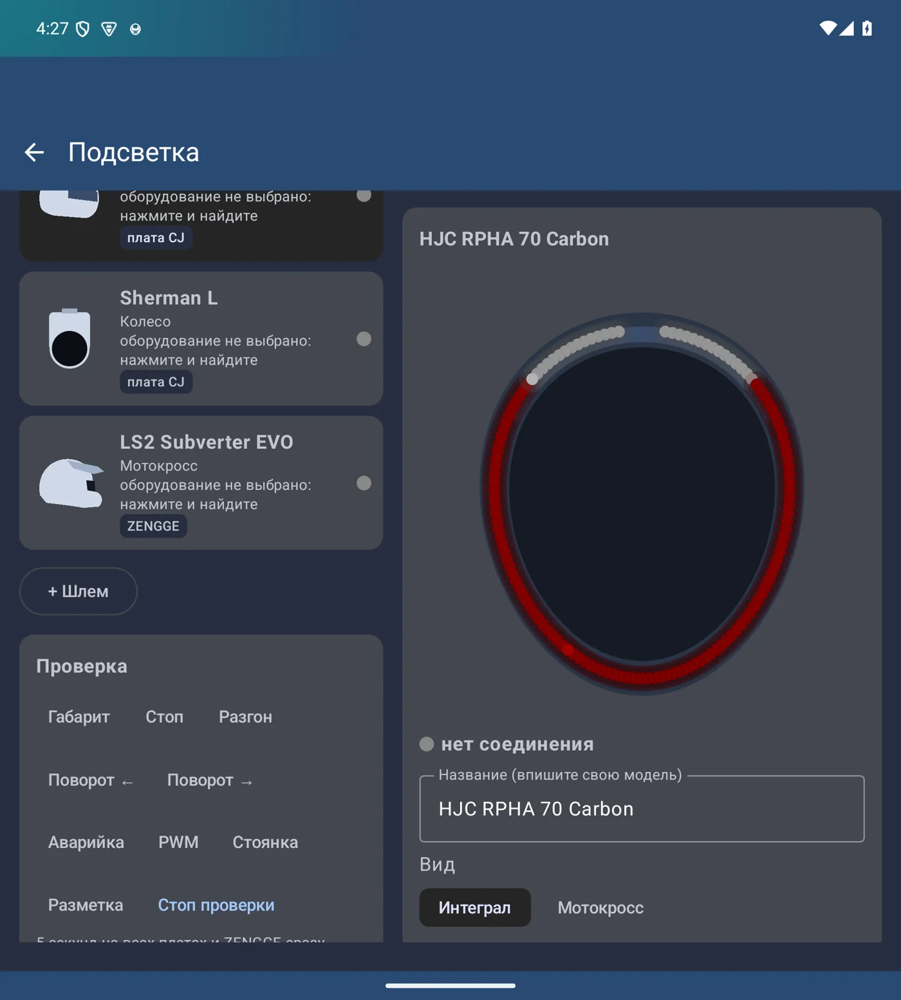

## Железо

<table>
<tr>
<td width="33%">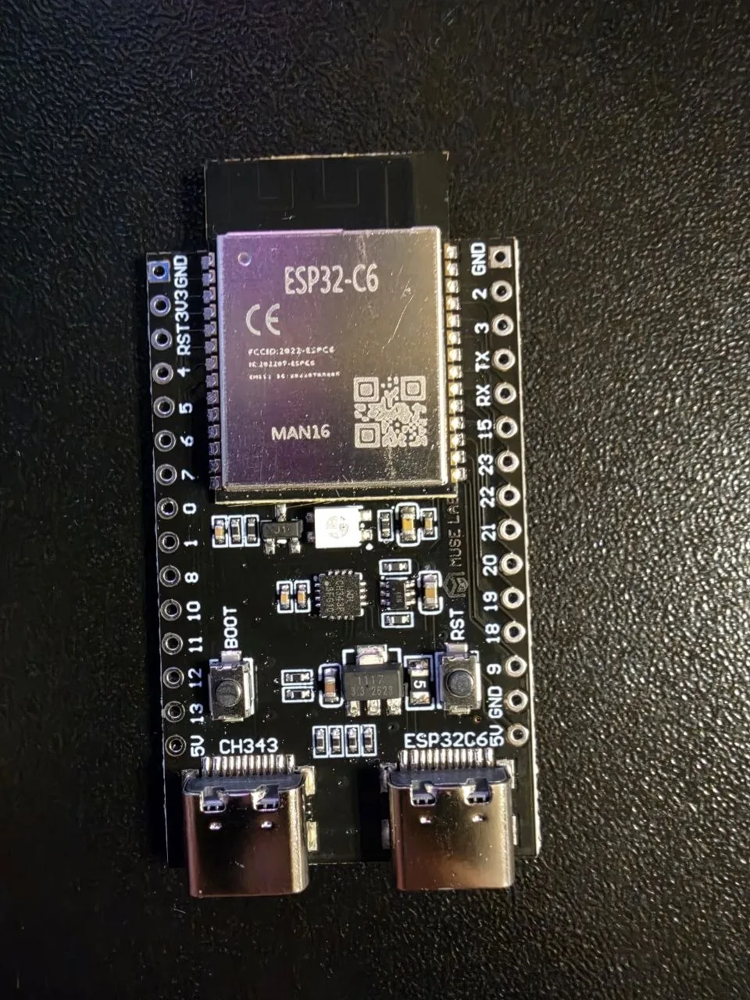</td>
<td width="33%">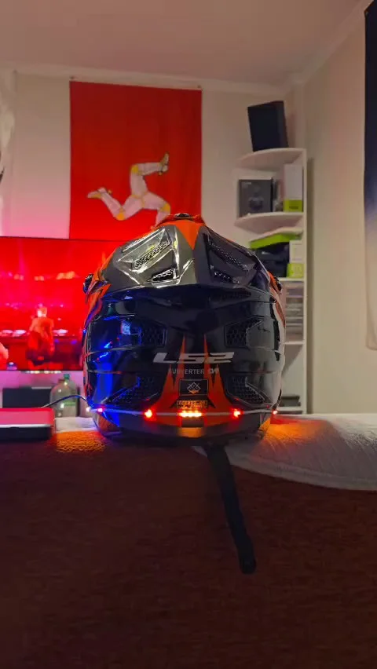</td>
<td width="33%">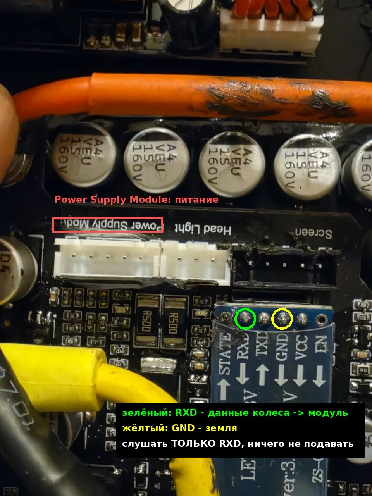</td>
</tr>
<tr>
<td align="center">nanoESP32-C6 - плата шлема</td>
<td align="center">LS2 Subverter EVO с контроллером ZENGGE</td>
<td align="center">Модуль Bluetooth колеса: слушаем только RXD</td>
</tr>
</table>

- **Шлем:** nanoESP32-C6 (или ESP32-C3 Super Mini) и адресная лента.
- **Второй шлем:** штатный Bluetooth-контроллер ZENGGE (LEDnetWF) - вся лента одним цветом.
- **Колесо:** ESP32-C3, питание 12 В от батареи колеса через MEAN WELL RSDW60H-12 со своей
  защитой; ветка света не трогает штатную фару и стоп колеса.

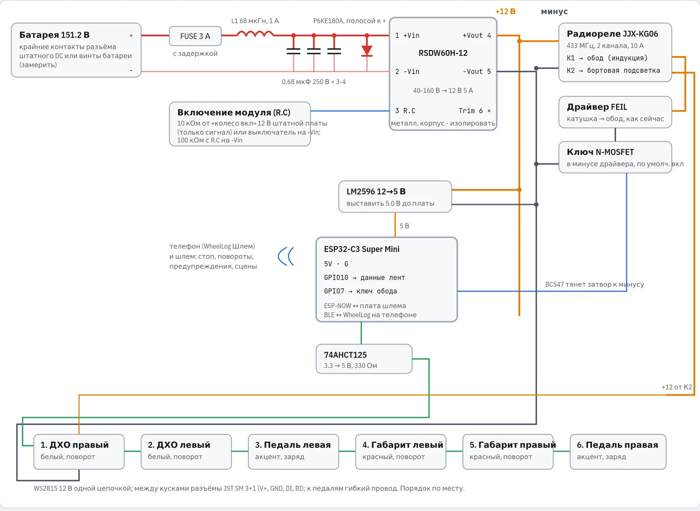

*Схема света колеса: питание от батареи, плата C3, ленты габаритов и педалей, реле обода.*

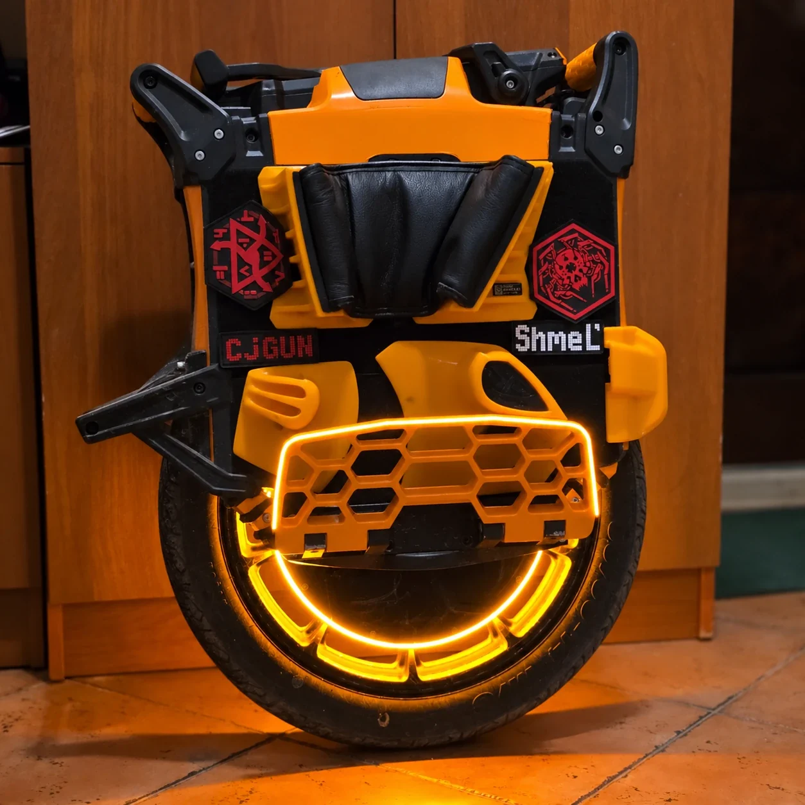

*Так задумано: Шмель с подсвеченным ободом и педалями. Это картинка по фото, а не снимок -
живое фото будет, когда соберём.*

## Шаги проекта

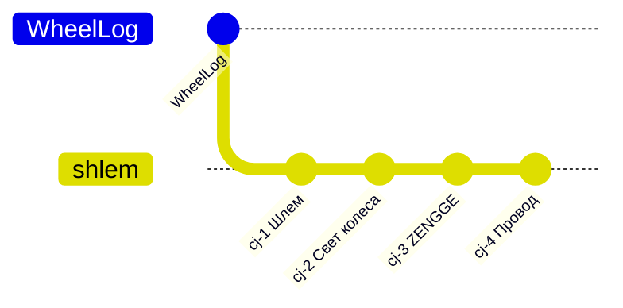
```mermaid
%%{init: {'gitGraph': {'mainBranchName': 'WheelLog'}}}%%
gitGraph
    commit id: "WheelLog"
    branch shlem
    commit id: "cj-1 Шлем"
    commit id: "cj-2 Свет колеса"
    commit id: "cj-3 ZENGGE"
    commit id: "cj-4 Провод"
```

1. **`cj-1-shlem`** - шлем со стоп-сигналом: плата в шлеме, модуль «Шлем» в приложении.
2. **`cj-2-svet-koleso`** - свет колеса: роли плат «шлем» и «колесо», связь ESP-NOW, раздел «Подсветка».
3. **`cj-3-zengge`** - дополнительный контроллер ZENGGE на втором шлеме.
4. **`cj-4-provod`** - провод: плата читает Bluetooth-модуль колеса напрямую.

Подробно по шагам - [cj-helmet/STEPS.md](cj-helmet/STEPS.md), протокол плат - [cj-helmet/README.md](cj-helmet/README.md).

## Скачать и собрать

- **APK:** вкладка [Actions](https://github.com/cjgun/WheelLog-Helmet/actions) → последняя
  сборка «CJ Helmet APK» → файл в Artifacts. Версии с метками `cj-*` - в
  [Releases](https://github.com/cjgun/WheelLog-Helmet/releases).
- Ставится рядом с обычным WheelLog: свой applicationId `com.cooper.wheellog.helmet`.
- **Прошивка:** папка [cj-helmet/fw](cj-helmet/fw), PlatformIO, платы `nano-c6` и `c3-mini`.
  Пароли Wi-Fi и обновления по воздуху - в `sekrety.h`, который в репозиторий не кладётся.

## Основа и лицензия

Это неофициальный форк **[WheelLog](https://github.com/Wheellog/Wheellog.Android)** -
приложения для моноколёс, которое написали и развивают его
[авторы и участники](https://github.com/Wheellog/Wheellog.Android/graphs/contributors).
Всё, что умеет WheelLog (поддержка колёс, журнал, часы, оповещения), здесь от них;
описание - в [README оригинала](https://github.com/Wheellog/Wheellog.Android#readme).

Как и оригинал, форк распространяется по лицензии **GNU GPL v3** - см. [LICENSE](LICENSE).
Изменения форка: модуль `helmet/`, раздел «Подсветка» и папка `cj-helmet/`.
Названия колёс, шлемов и контроллеров принадлежат их владельцам.

---

Сделано [cjgun](https://cjgun.ru) · история проекта - на [cjgun.ru/stati](https://cjgun.ru/stati/)
